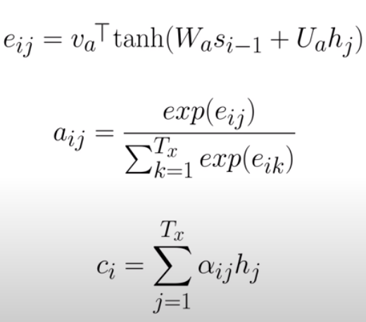

# Notebook

# Descripción
En este repositorio, creé un modelo de arquitectura *sequence to sequence* para la tarea de traducción de francés a inglés, utilizando el mecanismo de atención aditiva (Bahdanau) en el decoder.
- **Encoder:** El encoder toma la secuencia de tokens, y genera los hidden states para cada time step.
- **Decoder:** El decoder, para cada time step, toma los hidden states generados por el decoder y calcula los *attention weight scores* utilizando el mecanismo de atención aditiva de Bahdanau.
- **Attention mechanism:** El attention mechanism que usé en esta implementación fue *Bahdanau Attention*. Por ello, para calcular los *attention scores* y el *context vector*, usé la siguiente notación:

  

# Preprocesamiento de datos
- **Data:** Las oraciones, con las que se entrenó al modelo, tienen, como máximo, un *length* de 10. Esto se realizó con el objetivo de crear un diccionario que contenga las palabras del vocabulario para el mapeo a su token correspondiente.
- **Normalización:** Al normalizar las oraciones, tomé en cuenta algunos signos de puntuación. De esta manera, me aseguro de que a cada signo de puntuación se le asigne un token. Token que será representado por un vector de 'n' dimensiones a través de la Embedding Layer.

# Arquitectura
- **Encoder:**
  - **Embedding Layer:** Mapea el token a un vector de 'n' dimensiones, n: hiperparámetro de la dimensión del embedding.
  - **GRU Layer:** Recibe las secuencias de embeddings y genera un *hidden state* para cada *time step*.
  - **Dropout:** Adicionalmente, agregué una capa de dropout para evitar el overfitting temprano en la red.
    

  

- **Decoder:**
  - **Embedding Layer:** Cumple la misma función que la Embedding Layer del encoder --> Mapear la secuencia de tokens a una secuencia de embeddings.
  - **Attention mechanism:**
    - Recibe como parámetros los *hidden states* generados por el encoder, y el *hidden state* del time step previo del decoder para calcular los *attention weight scores*.
    - De esta manera, se tienen 2 matrices 'Wa' y 'Ua' que son aprendidas durante el entrenamiento, y 1 matriz adicional 'Va'.
    - Se realiza la suma de los resultados obtenidos por las matrices y se suman para aplicar la *tanh function*:
       -  tanh(Wa * s_i-1 + Ua * h_j); h_j: *hidden time* step que deriva del encoder, s_i-1: *hidden state* del *time step* previo del decoder. 
    - Posteriormente, se multiplica el resultado anterior con la matriz 'Va' y aplica la *softmax function* para normalizar los *scores* a un rango de [0,1], formando así una distribución de probabilidad, que representan, finalmente, los *weight scores*.
     - A continuación, muestro (en código) cómo realicé la implementación del Bahdanau Attention Mechanism: 
      

        
      

 

  

